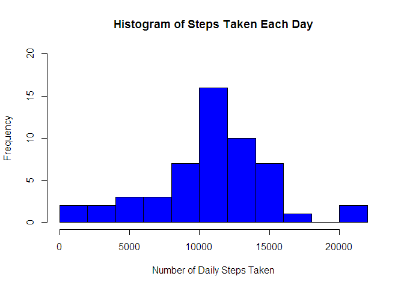
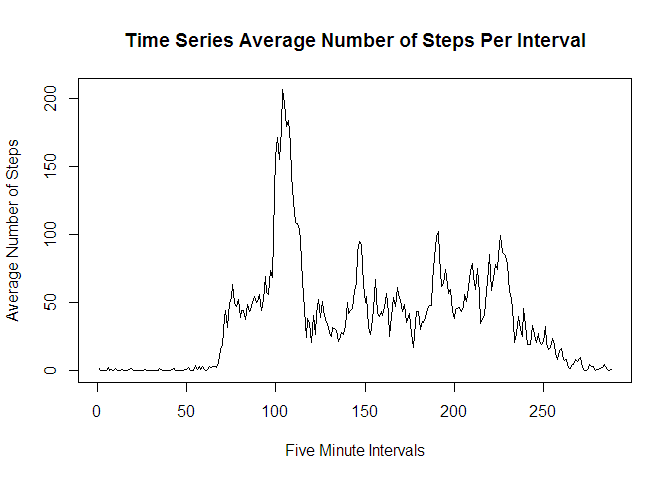
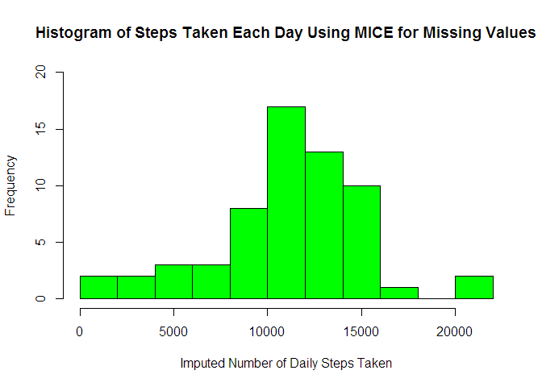
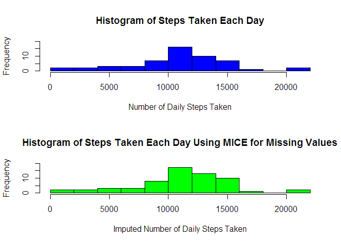
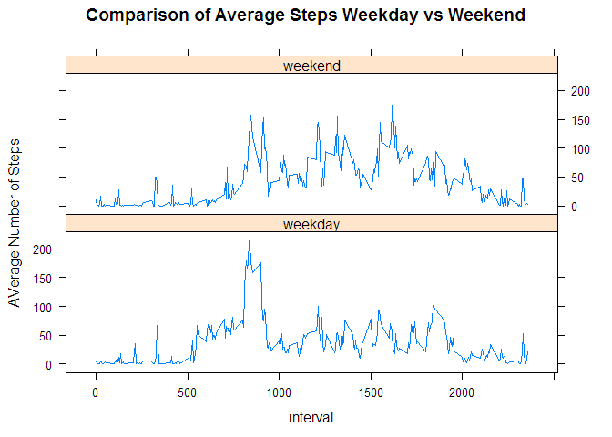

# Reproducible Research: Peer Assessment 1

  
## Loading and preprocessing the data

Activity.Data is a record of steps taken during a five minute interval
each day for two months (61 days) from October and November, 2012, by an anonymous person.

The dataset is approximately 52k size and it can be found at [Activity  Data](https://d396qusza40orc.cloudfront.net/repdata%2Fdata%2Factivity.zip)

The variables included in this dataset are:
  
* steps: Number of steps taking in a 5-minute interval (missing values are coded as NA)
* date: The date on which the measurement was taken in YYYY-MM-DD format
* interval: Identifier for the 5-minute interval in which measurement was taken

The dataset is stored in a comma-separated-value (CSV) file and there are a total of **17,568** observations in this dataset.

* activity.data.complete defines observations that have no missing values (NA).
* activity,data.complete.na defines observations that have missing values (NA).

1, Activty data is loaded
2. Activity data is separated into complete cases with no missing values and not complete cases with missing values.


```r
fileUrl <- "c:/Users/John/Documents/activity.csv"
activity.data <- read.csv(fileUrl, sep=",", header = TRUE)            
activity.data.complete <- activity.data[complete.cases(activity.data),]  
activity.data.complete.na <- activity.data[!complete.cases(activity.data),] 
```

## What is the total number of steps taken per day?

1. Determine the number f steps taken each day


```r
library("dplyr")
```

```
## 
## Attaching package: 'dplyr'
```

```
## The following objects are masked from 'package:stats':
## 
##     filter, lag
```

```
## The following objects are masked from 'package:base':
## 
##     intersect, setdiff, setequal, union
```

```r
steps.by.day <- aggregate(activity.data.complete$steps, by=list(activity.data.complete$date), FUN=sum)
names(steps.by.day) <- c("date", "steps") 
steps.per.day <- sum(steps.by.day$steps) 
steps.per.day
```

The total number of steps taken per day is **570608**.

## What does the histogram of total number of steps taken per day look like?

1. Make a histogram of the total number of steps taken each day


```r
par(mfrow=c(1,1))
hist(steps.by.day$steps, 
     ylim=c(0,20),
     xlab="Number of Daily Steps Taken",
     main="Histogram of Steps Taken Each Day", 
     col="blue",
     breaks=10)
```



## What is the mean (and median) total number of steps taken each day?

1.Calculate and report the mean and median total number of steps taken each day.


```r
median.print <- median(steps.by.day$steps) 
mean.print <- mean(steps.by.day$steps)  
median.print
```

```
## [1] 10765
```

```r
mean.print
```

```
## [1] 10766.19
```

The median number of steps taken each day is **10765**. 
The mean number of steps taken each day is **10766.19**.


## What is the average daily activity pattern?

1. Make a time series plot showing the average daily steps taken during a five minute interval.


```r
average.steps.per.interval <- aggregate(activity.data.complete$steps, by=list(activity.data.complete$interval), FUN=mean)
names(average.steps.per.interval) <- c("interval", "steps")
par(mfrow=c(1,1))
plot.ts(average.steps.per.interval$steps, type="l", 
        xlab= "Five Minute Intervals",
        ylab = "Average Number of Steps",
        main="Time Series Average Number of Steps Per Interval")
```



2. Determine the interval where the maximum number of steps occur


```r
max.interval <- average.steps.per.interval[which(average.steps.per.interval$steps == max(average.steps.per.interval$steps)),] 
max.interval
```

```
##     interval    steps
## 104      835 206.1698
```

The time series plot shows the largest number of steps are taken at **835** with 
**206.17**. This five minute interval corresponds to a time just after 1 pm.

## Imputing missing values

1. Determine the number of missing observations


```r
total.obs <- nrow(activity.data)
complete.obs <- nrow(activity.data.complete)
missing.obs <- nrow(activity.data.complete.na)
percent.missing <- nrow(activity.data.complete.na)/nrow(activity.data)*100
total.obs
```

```
## [1] 17568
```

```r
complete.obs
```

```
## [1] 15264
```

```r
missing.obs
```

```
## [1] 2304
```

```r
percent.missing
```

```
## [1] 13.11475
```

The total number of observations is **17568**. The number of observations which had complete cases is **15264**. The number of observatiosn which were missing data is **2304**. As a result, **13.11** percent of the total observations had missing data.

2. Strategy for imputing missing values

A google search led to the [Mice function](http://www.r-bloggers.com/imputing-missing-data-with-r-mice-package/) for imputing missing values to the dataset. The script used for imputing missing values for this assignment parallels the script used as example in the blog report. Because there are 50 by 5 iterations (which seem very tedious on my Asus M5Y71 (1.20-2.**ghz) laptop) I use the parameter printFlag=False to withhold each iteration from printing and also employ cache=TRUE as an r option to use a stored value rathher than to recalculate the missing values.

3. Code for imputing missing values


```r
library(mice)
```

```
## Loading required package: Rcpp
```

```
## mice 2.25 2015-11-09
```

```r
tempData <- mice(activity.data,m=5,maxit=50,meth='pmm',seed=500, printFlag=FALSE)
imputed.activity.data <- complete(tempData,1)
imputed.steps.by.day <- aggregate(imputed.activity.data$steps, by=list(imputed.activity.data$date), FUN=sum)
names(imputed.steps.by.day) <- c("date", "steps")
sum(imputed.steps.by.day$steps) 
```

```
## [1] 675486
```

```r
par(mfrow=c(1,1))
hist(imputed.steps.by.day$steps, 
     ylim=c(0,20),
     xlab="Imputed Number of Daily Steps Taken",
     main="Histogram of Steps Taken Each Day Using MICE for Missing Values", 
     col="green",
     breaks=10)
```



4. Changes to original mean and median from imputing values 


```r
imputed.median.print <- median(imputed.steps.by.day$steps) 
imputed.mean.print <- mean(imputed.steps.by.day$steps)   
median.increase <- (median(imputed.steps.by.day$steps) - median(steps.by.day$steps))/median(steps.by.day$steps)*100
mean.increase <- (mean(imputed.steps.by.day$steps) - mean(steps.by.day$steps))/mean(steps.by.day$steps)*100
imputed.median.print
```

```
## [1] 11162
```

```r
imputed.mean.print
```

```
## [1] 11073.54
```

```r
median.increase
```

```
## [1] 3.687877
```

```r
mean.increase
```

```
## [1] 2.854792
```

The mice function increased the median to **11162** and the mean to **11073.54**. Or a percentage increase of **3.69** for the median and a **2.85** percent increase for the mean. Basically, insubstantial.

4.The overall distribution from imputing the missing values  is largely unaffected as as easily seen on a  comparison plot of the two distributions' histograms: 


```r
par(mfrow=c(2,1))
hist(steps.by.day$steps, 
     ylim=c(0,20),
     xlab="Number of Daily Steps Taken",
     main="Histogram of Steps Taken Each Day", 
     col="blue",
     breaks=10)
hist(imputed.steps.by.day$steps, 
     ylim=c(0,20),
     xlab="Imputed Number of Daily Steps Taken",
     main="Histogram of Steps Taken Each Day Using MICE for Missing Values", 
     col="green",
     breaks=10)
```



## Are there differences in activity patterns between weekdays and weekends?

1. Create a factor variable for weekend/weekday activity distinction
To determine whether differences in activty patterns between weekdays and weekends exist, a factor variable 
identifying each day as a weekday day or weekend day is established while continuing to use the imputed dataset.


```r
imputed.activity.data$date <- as.Date(imputed.activity.data$date, format="%Y-%m-%d")
imputed.activity.data <- mutate(imputed.activity.data, dow <- weekdays(imputed.activity.data$date))
names(imputed.activity.data)[4] <- "day.of.week"
weekend.factor <- ifelse(imputed.activity.data$day.of.week == "Saturday" | imputed.activity.data$day.of.week == "Sunday", "weekend", "weekday")
imputed.activity.data <- cbind(imputed.activity.data, weekend.factor)
```

2. Make a panel plot of the weekend and weekend activty per 5 minute interval
A time series plot comparing the two activity patterns shows one key difference. The activity pattern for weekdays is a spike in activity just after 1 pm each day with relatively little activity on either side of it whereas the activity pattern for the weekend is sustained over a longer period of time once it commences in early afternoon. 


```r
library(data.table)
```

```
## 
## Attaching package: 'data.table'
```

```
## The following objects are masked from 'package:dplyr':
## 
##     between, last
```

```r
table.imputed.activity.data <- data.table(imputed.activity.data)
table.imputed.activity.data <- table.imputed.activity.data[, avgsteps := mean(steps), by=list(interval, weekend.factor)]
new.imputed.activity.data <- as.data.frame(table.imputed.activity.data)
new.imputed.activity.data <- arrange(new.imputed.activity.data, interval, weekend.factor)
library(lattice)
par(mfrow=c(1,1))
xyplot(avgsteps ~ interval | weekend.factor,
       data=new.imputed.activity.data,
       ylab = "AVerage Number of Steps",
       layout=(c(1,2)),
       main="Comparison of Average Steps Weekday vs Weekend",
       type = "l")
```


